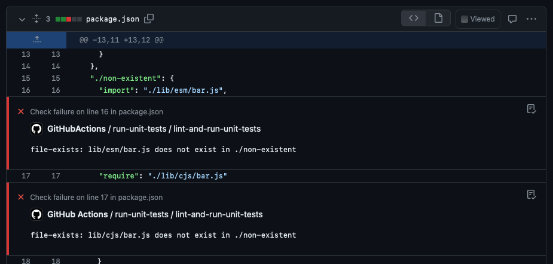
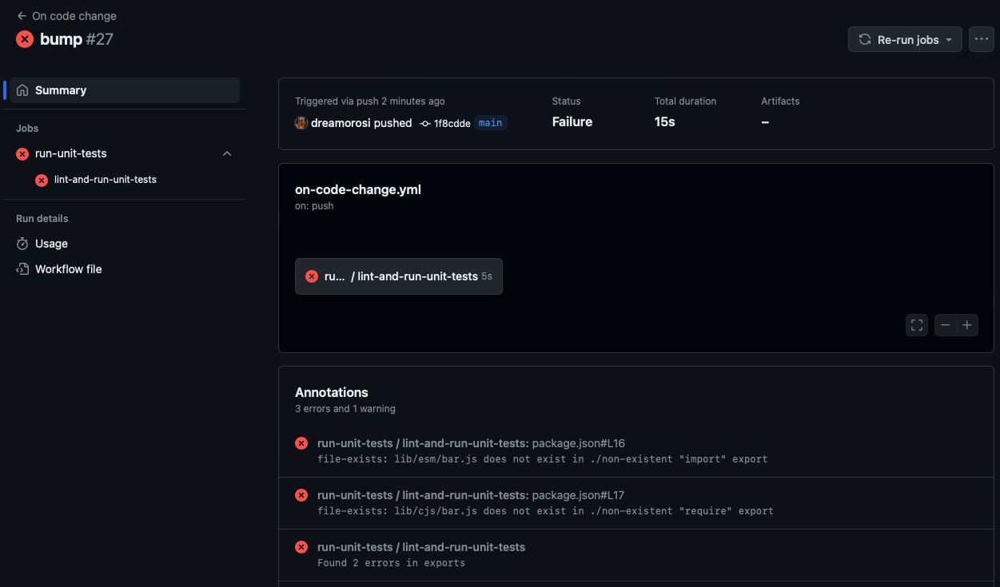

# Validate Package Exports Action

This GitHub Action validates the Node.js `exports` field in one or more `package.json` files and reports rich error messages directly in your pull request or commit.

The action is a wrapper around the [validate-package-exports](https://github.com/webdeveric/validate-package-exports) CLI by [webdeveric](https://github.com/webdeveric).

## Usage

In your GitHub Actions workflow, add the following step:

```yaml
- name: Validate package exports
  uses: dreamorosi/validate-package-exports-action@v0.0.11
  with:
    # The path to the package.json file(s) to validate.
    # This is relative to the root of the repository and accepts patterns like `packages/*/package.json`.
    inputFiles: './package.json'
```

If the validation fails during PR checks, the action will report the error messages as annotations in the "Files changed" tab under the file where the error was found.



If instead the validation fails during a push, the action will report the error messages in the summary of the commit.



In both cases, if the actions fails, the workflow will stop and its status will be marked as "failed".

> [!IMPORTANT]
> It's recommended to pin a specific version of the `validate-package-exports` package in your project's dependencies to avoid inconsistencies between local and CI environments. When present, the action will use the version specified in the `package.json` file. If not, it will try to install and use the latest version available on npm.

## Example

```yaml
name: Validate package exports

on:
  push:
    branches:
      - 'main'
  pull_request:

jobs:
  lint-and-run-unit-tests:
    runs-on: ubuntu-latest
    env:
      NODE_ENV: dev
    steps:
      - name: Checkout code
        uses: actions/checkout@8e5e7e5ab8b370d6c329ec480221332ada57f0ab  # v3.5.2
      - name: Setup Node.js
        uses: actions/setup-node@60edb5dd545a775178f52524783378180af0d1f8 # v4.0.2
        with:
          node-version: '20'
      - name: Cache node modules
        id: cache-node-modules
        uses: actions/cache@13aacd865c20de90d75de3b17ebe84f7a17d57d2 # v4.0.0
        with:
          path: '**/node_modules'
          # Use the combo between node version, name, and SHA-256 hash of the lock file as cache key so that
          # if one of them changes the cache is invalidated/discarded
          key: cache-utilities-node-modules-${{ hashFiles('./package-lock.json') }}
      - name: Install dependencies
        # We can skip the installation if there was a cache hit
        if: steps.cache-node-modules.outputs.cache-hit != 'true'
        run: npm ci
        shell: bash
      - name: Validate package exports
        uses: dreamorosi/validate-package-exports-action@v0.0.11
        with:
          inputFiles: './package.json'
```